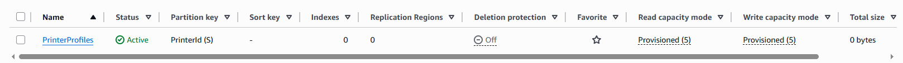
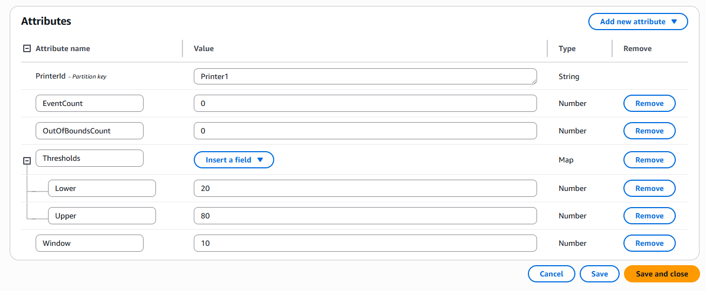
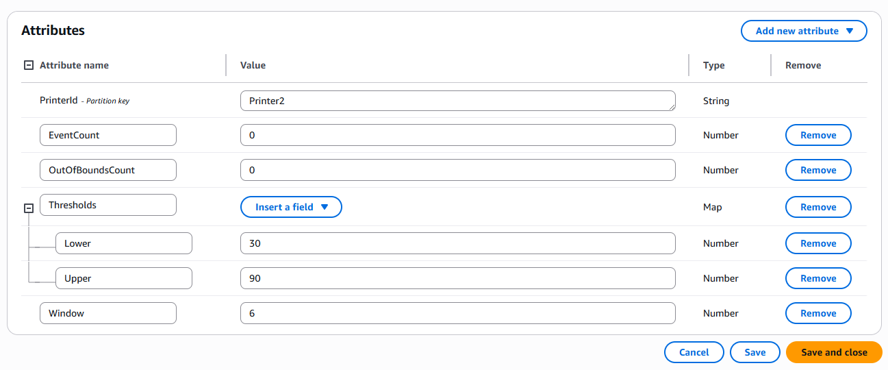
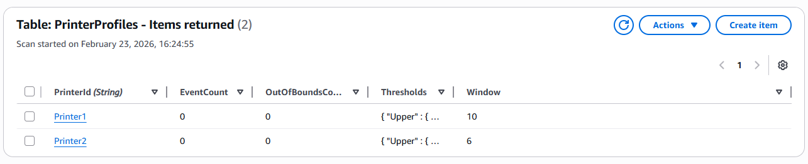

[🇧🇷 Versão em Português](#-versão-em-português)

## Step 01 - Creating the table in DDB:

I started by creating the PrinterProfiles table in DDB, defining PrinterId as the primary key of type string and configuring the provisioned read and write capacity to support the system operations:

```
aws dynamodb create-table \
  --table-name PrinterProfiles \
  --attribute-definitions AttributeName=PrinterId,AttributeType=S \
  --key-schema AttributeName=PrinterId,KeyType=HASH \
  --provisioned-throughput ReadCapacityUnits=5,WriteCapacityUnits=5 \
  --region us-east-1
```

One-line version for Git Bash:

`aws dynamodb create-table --table-name PrinterProfiles --attribute-definitions AttributeName=PrinterId,AttributeType=S --key-schema AttributeName=PrinterId,KeyType=HASH --provisioned-throughput ReadCapacityUnits=5,WriteCapacityUnits=5 --region us-east-1`



I created two items in the PrinterProfiles table, one for each printer. I initialized the event counters to zero and defined the minimum and maximum operating thresholds, as well as the analysis window size that will be used for anomaly detection:

```
aws dynamodb put-item \
  --table-name PrinterProfiles \
  --item '{
    "PrinterId": {"S": "Printer1"},
    "EventCount": {"N": "0"},
    "OutOfBoundsCount": {"N": "0"},
    "Thresholds": {"M": {
      "Lower": {"N": "20"},
      "Upper": {"N": "80"}
    }},
    "Window": {"N": "10"}
  }' \
  --region us-east-1
```

One-line:

`aws dynamodb put-item --table-name PrinterProfiles --item '{"PrinterId":{"S":"Printer1"},"EventCount":{"N":"0"},"OutOfBoundsCount":{"N":"0"},"Thresholds":{"M":{"Lower":{"N":"20"},"Upper":{"N":"80"}}},"Window":{"N":"10"}}' --region us-east-1`



```
aws dynamodb put-item \
  --table-name PrinterProfiles \
  --item '{
    "PrinterId": {"S": "Printer2"},
    "EventCount": {"N": "0"},
    "OutOfBoundsCount": {"N": "0"},
    "Thresholds": {"M": {
      "Lower": {"N": "30"},
      "Upper": {"N": "90"}
    }},
    "Window": {"N": "6"}
  }' \
  --region us-east-1
```

One-line:

`aws dynamodb put-item --table-name PrinterProfiles --item '{"PrinterId":{"S":"Printer2"},"EventCount":{"N":"0"},"OutOfBoundsCount":{"N":"0"},"Thresholds":{"M":{"Lower":{"N":"30"},"Upper":{"N":"90"}}},"Window":{"N":"6"}}' --region us-east-1`





---

# 🇧🇷 Versão em Português

## Passo 01 - Criando a table no DDB:

Comecei criando a tabela PrinterProfiles no DDB, definindo PrinterId como chave primária do tipo string e configurando a capacidade provisionada de leitura e escrita para suportar as operações do sistema:

```
aws dynamodb create-table \
  --table-name PrinterProfiles \
  --attribute-definitions AttributeName=PrinterId,AttributeType=S \
  --key-schema AttributeName=PrinterId,KeyType=HASH \
  --provisioned-throughput ReadCapacityUnits=5,WriteCapacityUnits=5 \
  --region us-east-1
```

Versão One-Line para GitBash:

`aws dynamodb create-table --table-name PrinterProfiles --attribute-definitions AttributeName=PrinterId,AttributeType=S --key-schema AttributeName=PrinterId,KeyType=HASH --provisioned-throughput ReadCapacityUnits=5,WriteCapacityUnits=5 --region us-east-1`


Criei dois itens na tabela PrinterProfiles, um para cada impressora. Inicializei os contadores de eventos em zero e defini os limites mínimo e máximo de operação, além do tamanho da janela de análise que será usada na detecção de anomalias:

```
aws dynamodb put-item \
  --table-name PrinterProfiles \
  --item '{
    "PrinterId": {"S": "Printer1"},
    "EventCount": {"N": "0"},
    "OutOfBoundsCount": {"N": "0"},
    "Thresholds": {"M": {
      "Lower": {"N": "20"},
      "Upper": {"N": "80"}
    }},
    "Window": {"N": "10"}
  }' \
  --region us-east-1
```

One-line:

`aws dynamodb put-item --table-name PrinterProfiles --item '{"PrinterId":{"S":"Printer1"},"EventCount":{"N":"0"},"OutOfBoundsCount":{"N":"0"},"Thresholds":{"M":{"Lower":{"N":"20"},"Upper":{"N":"80"}}},"Window":{"N":"10"}}' --region us-east-1`


```
aws dynamodb put-item \
  --table-name PrinterProfiles \
  --item '{
    "PrinterId": {"S": "Printer2"},
    "EventCount": {"N": "0"},
    "OutOfBoundsCount": {"N": "0"},
    "Thresholds": {"M": {
      "Lower": {"N": "30"},
      "Upper": {"N": "90"}
    }},
    "Window": {"N": "6"}
  }' \
  --region us-east-1
```

One-line:

`aws dynamodb put-item --table-name PrinterProfiles --item '{"PrinterId":{"S":"Printer2"},"EventCount":{"N":"0"},"OutOfBoundsCount":{"N":"0"},"Thresholds":{"M":{"Lower":{"N":"30"},"Upper":{"N":"90"}}},"Window":{"N":"6"}}' --region us-east-1`


