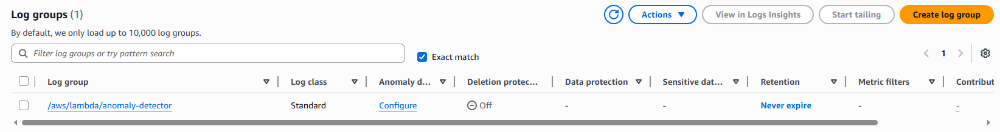
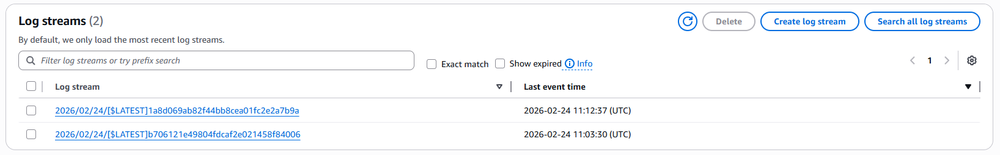
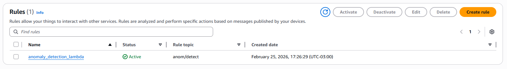
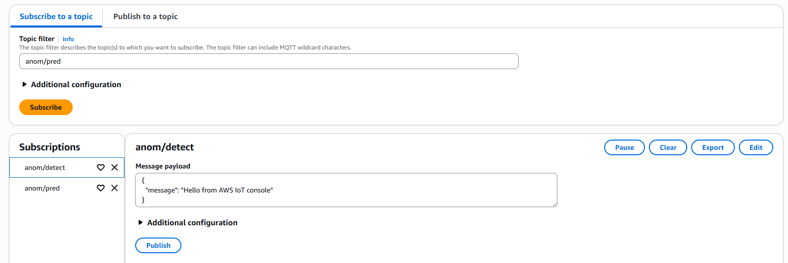
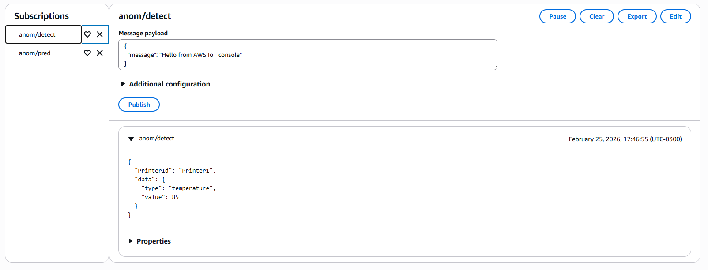
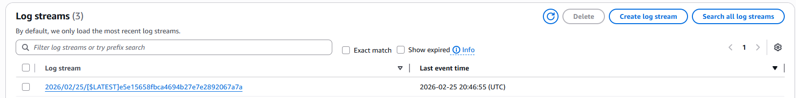
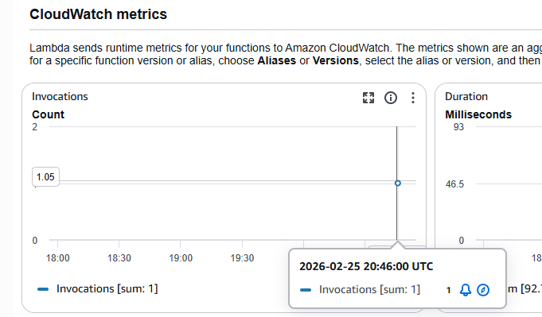

Antes de criar a lambda function, vou preparar a role e a policy que ela vai utilizar. Como as policies podem ser lidas em json, criei um arquivo chamado [role-policy-iot-lambda.json](../../backend/role-policy-iot-lambda.json) para colocar os serviços que vou permitir. O arquivo contém:

```json
{
  "Version": "2012-10-17",
  "Statement": [
    {
      "Sid": "",
      "Effect": "Allow",
      "Principal": {
        "Service": [
          "lambda.amazonaws.com",
          "iot.amazonaws.com"
        ]
      },
      "Action": "sts:AssumeRole"
    }
  ]
}
```

Com isso, o AWS IoT e o Lambda podem assumir essa role para executar ações com as permissões que estiverem anexadas a ela. Rodei o comando para criar a role:

`aws iam create-role --role-name role-iot-lambda --assume-role-policy-document file://backend/role-policy-iot-lambda.json`


Também criei o json da policy de permissão em [permission-policy.json](../../backend/permission-policy.json):

```json
{
  "Version": "2012-10-17",
  "Statement": [
    {
      "Sid": "StmtDynamoDBAccess",
      "Action": [
        "dynamodb:GetItem",
        "dynamodb:PutItem",
        "dynamodb:Scan",
        "dynamodb:UpdateItem"
      ],
      "Effect": "Allow",
      "Resource": "*"
    },
    {
      "Sid": "StmtIoTAccess",
      "Action": [
        "iot:Connect",
        "iot:Publish",
        "iot:Receive",
        "iot:Subscribe"
      ],
      "Effect": "Allow",
      "Resource": "*"
    },
    {
      "Sid": "StmtLogsAccess",
      "Effect": "Allow",
      "Action": [
        "logs:CreateLogGroup",
        "logs:CreateLogStream",
        "logs:PutLogEvents"
      ],
      "Resource": "arn:aws:logs:*:*:*"
    }
  ]
}
```

Depois, executei o comando:

`aws iam create-policy --policy-name permission-policy-lambda --policy-document file://backend/permission-policy-lambda.json`


Anexei a policy na role usando o comando:

`aws iam attach-role-policy --role-name role-iot-lambda --policy-arn arn:aws:iam::xxxxxxxxxxxxxxx:policy/permission-policy-lambda`


Para criar o Lambda por CLI, preparei a function em um arquivo.py: [lambda-function.py](../../backend/lambda-function.py). O comando para criar a function não aceita .py, para contornar isso preciso criar um pacote de deploy .zip. Tudo que fiz foi zippar o .py usando winrar e preparar o comando com o arn da role e o zip-file:

```bash
aws lambda create-function \
  --function-name anomaly-detector \
  --runtime python3.9 \
  --role arn:aws:iam::xxxxxxxxxxxxx:role/role-iot-lambda \
  --handler lambda_function.lambda_handler \
  --timeout 15 \
  --memory-size 512 \
  --zip-file fileb://backend/lambda_function.zip
```

One-line:

`aws lambda create-function --function-name anomaly-detector --runtime python3.9 --role arn:aws:iam::xxxxxxxxxxxxx:role/role-iot-lambda --handler lambda_function.lambda_handler --timeout 15 --memory-size 512 --zip-file fileb://backend/lambda-function.zip`


Rodei um teste com o input:

```json
{
  "PrinterId": "Printer1",
  "data": {
    "type": "temperature",
    "value": 85
  }
}
```


Vou conferir se o log group também foi criado e se o evento ja esta sendo registrado:





Agora vou prosseguir para configurar a IoT Rule. Criei a rule em um json [anomaly-rule.json](../../backend/anomaly-rule.json) para fazer via CLI. A rule ativa o Lambda function sempre que uma mensagem for publicada em um tópico anom/detect. A json contém:

```json
{
    "sql": "SELECT * FROM 'anom/detect'",
    "ruleDisabled": false,
    "actions": [
        {
            "lambda": {
                "arn:aws:lambda:us-east-1:xxxxxxxxxxxxxx:function:anomaly-detector"
            }
        }
    ]
}
```

Com o json criado, vou criar a rule pelo CLI:

```bash
aws iot create-topic-rule \
  --rule-name anomaly_detection_lambda \
  --topic-rule-payload file://backend/anomaly-rule.json
```

One-line:

`aws iot create-topic-rule --rule-name anomaly_detection_lambda --topic-rule-payload file://backend/anomaly-rule.json`



Antes de testar, preciso adicionar uma permissão no Lambda para especificar qual Iot rule a function pode invocar:

```bash
aws lambda add-permission
  --function-name "anomaly-detector"
  --region "us-east-1"
  --principal iot.amazonaws.com
  --source-arn arn:aws:iot:us-east-1:xxxxxxxxxxxx:rule/anomaly_detection_lambda
  --source-account "xxxxxxxxxxxx"
  --statement-id "AllowIoTInvoke"
  --action "lambda:InvokeFunction"
```

One-line:

`aws lambda add-permission --function-name "anomaly-detector" --region "us-east-1" --principal iot.amazonaws.com --source-arn arn:aws:iot:us-east-1:xxxxxxxxxxxx:rule/anomaly_detection_lambda --source-account "xxxxxxxxxxxx" --statement-id "AllowIoTInvoke" --action "lambda:InvokeFunction"`

Depois disso, criei dois topics e fui para o teste:



Mandei o payload pelo console:

```bash
aws iot-data publish \
  --topic "anom/detect" \
  --qos 1 \
  --payload "$(echo -n '{"PrinterId": "Printer1", "data": {"type": "temperature", "value": 85}}' | base64)"
```

One-line:

`aws iot-data publish --topic "anom/detect" --qos 1 --payload "$(echo -n '{"PrinterId": "Printer1", "data": {"type": "temperature", "value": 85}}' | base64)"`

Resultados:





